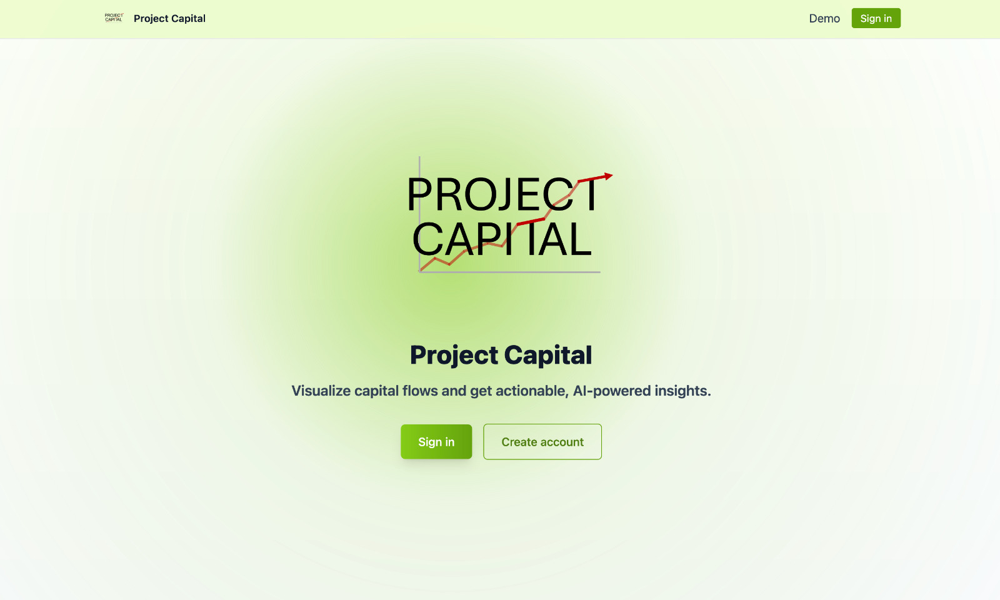
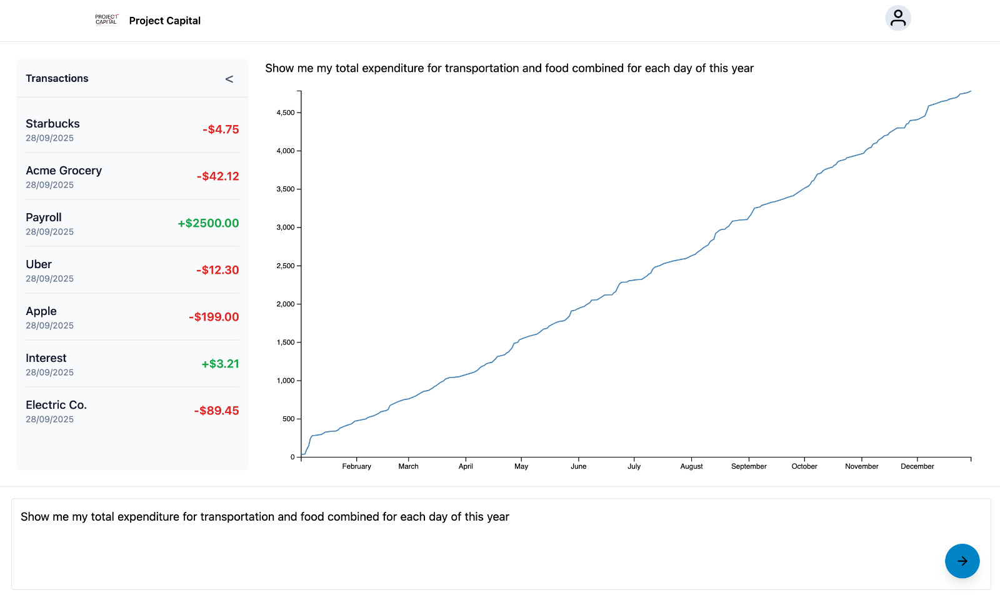
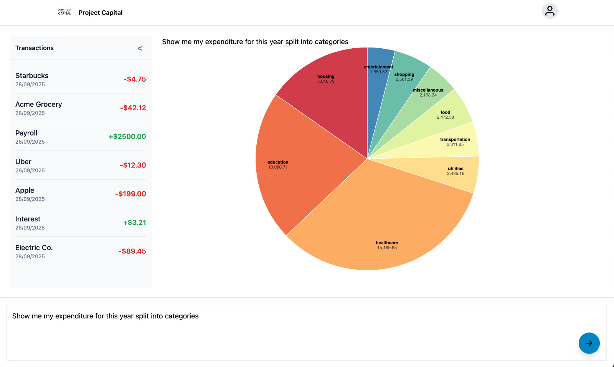
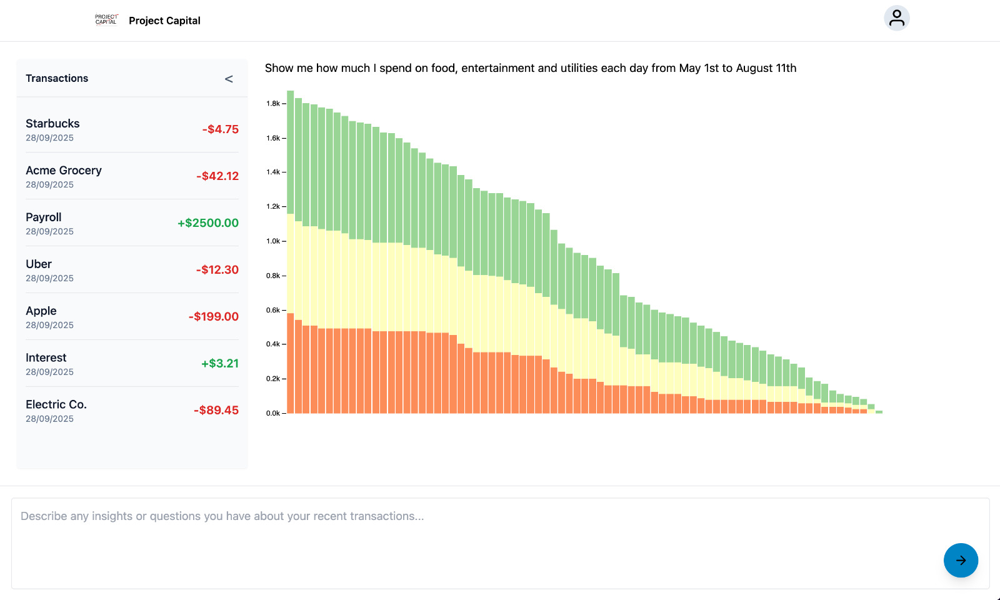

# Project Capital

_This was a hackathon submission to HackGT'12_

Project Capital is a next-generation fintech platform aimed at simplifying personal finance management and making financial education accessible to all. Our web application provides anyone with a bank account with greater insights into their finances by generating data visualizations based on their transactions through simple prompts.

## Motivation

According to an Intuit survey, over 60% of people are unaware of the amount of money that they are spending, establishing the need for banking apps that help monitor a user’s transactions and account balances. However, many people have faced issues with current banking apps provided by various institutions. In a recent survey, 47% of participants claimed they were experiencing poor user interface and 37% claimed a lack of enough features.

That’s why we created a banking app providing information about transactions and accompanying visualization to illustrate the data. Instead of creating pre-selected options for features, which often fail to include important information or contain unnecessary information, we created a conversational interface, where users can input questions relating to their banking data. The banking data stored in our system for each transaction is the monetary amount, date of transaction, card type, transaction ID, and the customer’s account ID. For example, this includes transactions that occurred within particular periods of time and the distribution between various categories of spending. Each query will be supported with a graph that best supports the data for the corresponding question. Additionally, there will also be a chart illustrating every transaction in chronological order, including the data and place of purchase.

## Tech Stack

Project Capital uses MongoDB and FastAPI for our data management and backend. Much of the data was randomized mock data to protect people's privacy and to generalize our models. For the frontend, we utilized React and D3.js for our visualization. Google Gemini's large language model supports our prompt-aided visualizations.

## How to run the code?

### Database
Install the community edition of mongodb from [here](https://www.mongodb.com/docs/manual/administration/install-community/?macos-installation-method=homebrew&operating-system=macos). Ensure that this installs mongosh as well. Once this is done, continue to follow the linked documentation to start the mongod service.

### Datagen
We use a python script to generate randomized mock data. Ahead of running the script ensure that you have python and miniconda installed on your system ([python](https://www.python.org/downloads/), [miniconda](https://www.anaconda.com/docs/getting-started/miniconda/install)). Then run the following commands
```
shell> cd datagen
shell> conda env create -f hackgt-env.yaml
shell> conda activate banking-dashboard
shell> python databasegen.py
```

### Backend
To run the backend we will need to install fastapi which can be done as follows
```
shell> pip install "fastapi[standard]"
```

To run the backend
```
shell> cd backend
shell> fastapi dev main.py
```

### Frontend
Since the frontend will need to use the gemini API, you will need to [generate an API key](https://ai.google.dev/gemini-api/docs/quickstart). Once thats done create a file named `.env` in the frontend folder and add the following code to it
```
VITE_GEMINI_API_KEY=<insert-api-key-here>
```

To run the frontend
```
shell> cd frontend
shell> npm i
shell> npm run dev
```


## Gallery





